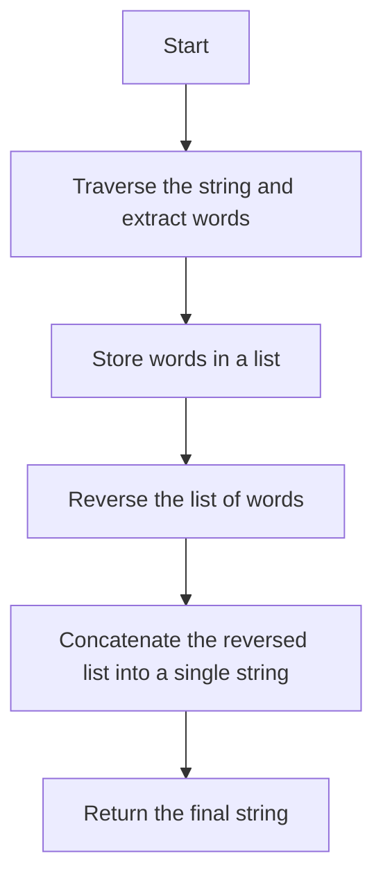

# 151. Reverse Words in a String

## Problem Statement

Given an input string `s`, reverse the order of the **words**.

A **word** is defined as a sequence of non-space characters. The words in `s` will be separated by at least one space.

Return a string of the words in reverse order concatenated by a single space.

### Example 1:
```
Input: s = "the sky is blue"
Output: "blue is sky the"
```

### Example 2:
```
Input: s = "  hello world  "
Output: "world hello"
Explanation: Your reversed string should not contain leading or trailing spaces.
```

### Example 3:
```
Input: s = "a good   example"
Output: "example good a"
Explanation: You need to reduce multiple spaces between two words to a single space in the reversed string
```

---

## Approach

We have to ensure that the string is properly formatted, which means we need to remove `leading`, `trailing`, and `extra spaces` between words.

To achieve this, we can follow these steps:

1. Traverse the string and extract the words while ignoring extra spaces. We can use a `StringBuilder` to build each word and a `List` to store the words.

2. Once we have the list of words, we can `reverse` the list to get the words in the desired order.

3. Finally, we can concatenate the reversed list of words into a single string with a single space between them.



---

## Code Implementation

```java
class Solution {
    public String reverseWords(String s) {
        int i = 0, n = s.length();
        List<String> words = new ArrayList<>();

        while(i < n){
            while(i < n && s.charAt(i) == ' ') i++;
            StringBuilder word = new StringBuilder();
            while(i < n && s.charAt(i) != ' '){
                word.append(s.charAt(i));
                i++;
            }
            if(!word.isEmpty()) words.add(word.toString());
        }
        Collections.reverse(words);

        StringBuilder newStr = new StringBuilder();
        for(i = 0; i < words.size(); i++){
            newStr.append(words.get(i));
            if(i != words.size() - 1) newStr.append(' ');
        }

        return newStr.toString();
    }
}
```

---

## Complexity Analysis

- **Time Complexity**: O(n), where n is the length of the input string `s`. We traverse the string once to extract the words and then reverse the list of words, which also takes O(n) time.

- **Space Complexity**: O(n) for storing the list of words and the new string.

---