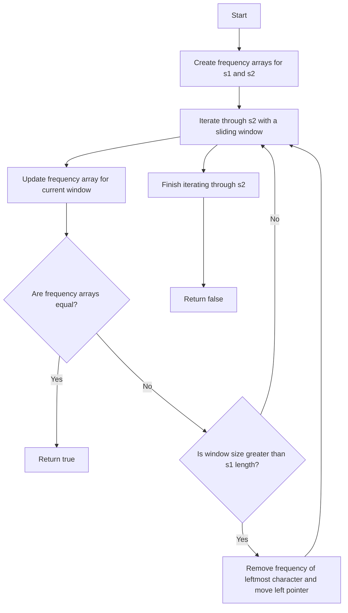

# 567. Permutation in String

## Problem Statement

Given two strings `s1` and `s2`, return `true` if `s2` contains a permutation of `s1`, or `false` otherwise.

In other words, return `true` if one of `s1`'s permutations is the substring of `s2`, or `false` otherwise.

### Example 1:
```
Input: s1 = "ab", s2 = "eidbaooo"
Output: true
Explanation: s2 contains one permutation of s1 ("ba").
```

### Example 2:
```
Input: s1 = "ab", s2 = "eidboaoo"
Output: false
```

---

## Approach

To determine if `s2` contains a permutation of `s1`, we can use a sliding window approach along with frequency counting.

1. First, we will create two frequency arrays of size 26 (for lowercase English letters) to count the frequency of characters in `s1` and the current window of `s2`.

2. We will iterate through `s2` using a sliding window of size equal to the length of `s1`. For each character in the current window, we will update the frequency array for `s2`.

3. After updating the frequency array for the current window, we will compare it with the frequency array of `s1`. If they are equal, it means we have found a permutation of `s1` in `s2`, and we can return `true`. 

- use `Arrays.equals(freq1, freq2)` to compare the two frequency arrays.

4. If the window size exceeds the length of `s1`, we will remove the frequency of the leftmost character in the window from the frequency array of `s2` and move the left pointer of the window to the right.

5. If we finish iterating through `s2` without finding any permutation of `s1`, we will return `false`.



---

## Code Implementation

```java
class Solution {
    public boolean checkInclusion(String s1, String s2) {
        int m = s2.length(), n = s1.length();
        
        int freq1[] = new int[26];
        int freq2[] = new int[26];
        Arrays.fill(freq1, 0); Arrays.fill(freq2, 0);
        
        for(int i = 0; i < s1.length(); i++){
            freq1[s1.charAt(i) - 'a']++;
        }
        
        int left = 0, right = 0;
        while(right < m){
            freq2[s2.charAt(right) - 'a']++;
            if(right - left + 1 > n){
                freq2[s2.charAt(left) - 'a']--;
                left++;
            }
            if(Arrays.equals(freq1, freq2)) return true;
            right++;
        }
        return false;        
    }
}
```

---

## Complexity Analysis

- **Time Complexity**: O(m * 26) where m is the length of `s2`. We are iterating through `s2` once and comparing the frequency arrays which takes O(26) time.

- **Space Complexity**: O(1) since the frequency arrays have a fixed size of 26 (for lowercase English letters).

---