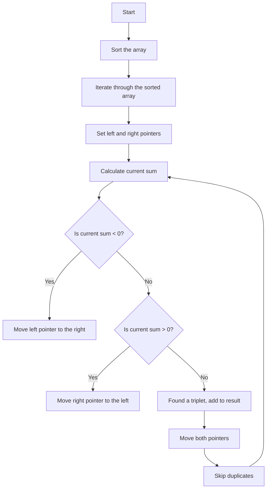

# 15. 3Sum

## Problem Statement

Given an integer array `nums`, return all the triplets `[nums[i], nums[j], nums[k]]` such that `i != j`, `i != k`, and `j != k`, and `nums[i] + nums[j] + nums[k] == 0`.

The solution set must not contain duplicate triplets.

### Example 1:
```
Input: nums = [-1,0,1,2,-1,-4]
Output: [[-1,-1,2],[-1,0,1]]
Explanation:
nums[0] + nums[1] + nums[2] = (-1) + 0 + 1 = 0.
nums[1] + nums[2] + nums[4] = 0 + 1 + (-1) = 0.
nums[0] + nums[3] + nums[4] = (-1) + 2 + (-1) = 0.
The distinct triplets are [-1,0,1] and [-1,-1,2].
Notice that the order of the output and the order of the triplets does not matter.
```

### Example 2:
```
Input: nums = [0,1,1]
Output: []
Explanation: The only possible triplet does not sum up to 0.
```

### Example 3:
```
Input: nums = [0,0,0]
Output: [[0,0,0]]
Explanation: The only possible triplet sums up to 0.
```

---

## Approach

We are given an array of integers and we need to find all unique triplets in the array which gives the sum of zero.

To solve this problem, we can use the two pointers technique. The idea is to first `sort` the array and then use `two pointers` to find pairs that sum up to a specific target.

1. We will iterate through the sorted array and for each element, we will set `two pointers` - one starting from the next element `(left)` and the other starting from the end of the array `(right)`.

2. Calculate the current sum of all three elements (i.e., `nums[i] + nums[left] + nums[right]`).

3. If the current sum is less than zero, it means we need a larger sum, so we will move the `left` pointer to the right.

4. If the current sum is greater than zero, it means we need a smaller sum, so we will move the `right` pointer to the left.

5. If the current sum is equal to zero, we have found a `triplet`. We will add this triplet to our result list and then move both pointers to find the next potential triplet.

6. To avoid duplicates, we will skip over any duplicate elements in the sorted array.



---

## Code Implementation

```cpp
class Solution {
public:
    vector<vector<int>> threeSum(vector<int>& nums) {
        int n = nums.size();
        sort(nums.begin(), nums.end());
        vector<vector<int>> result;
        
        for(int i = 0; i < n; i++){
            if(i != 0 && nums[i - 1] == nums[i]) continue;

            int left = i + 1, right = n - 1;
            
            while(left < right){
                int total = nums[i] + nums[left] + nums[right];
                if(total > 0){
                    right--;
                }
                else if(total < 0){
                    left++;
                }
                else{
                    result.push_back({nums[i], nums[left], nums[right]});
                    while(left < right && nums[left] == nums[left + 1]) left++;
                    while(left < right && nums[right] == nums[right - 1]) right--;
                    left++; right--;
                }
            }
        }
        return result;
    }
};

```

--- 

## Complexity Analysis

- **Time Complexity**: O(n^2), where `n` is the length of the input array `nums`. This is because we have a nested loop where the outer loop runs `n` times and the inner loop runs at most `n` times in total across all iterations of the outer loop.

- **Space Complexity**: O(1) if we don't consider the space used for the output, otherwise O(k) where `k` is the number of triplets in the output.

---