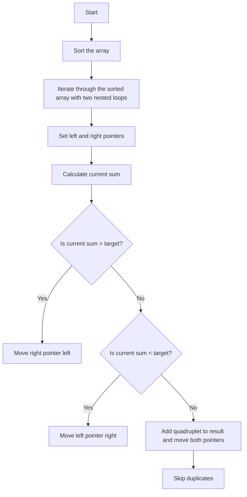

# 18. 4Sum

## Problem Statement

Given an array `nums` of `n` integers and an integer `target`, return an array of all the unique quadruplets `[nums[a], nums[b], nums[c], nums[d]]` such that:

- `0 <= a, b, c, d < n`
- `a`, `b`, `c`, and `d` are distinct.
- `nums[a] + nums[b] + nums[c] + nums[d] == target

The solution set must not contain duplicate quadruplets. Return the solution in any order.

### Example 1:
```
Input: nums = [1,0,-1,0,-2,2], target = 0
Output: [[-2,-1,1,2],[-2,0,0,2],[-1,0,0,1]]
```

### Example 2:
```
Input: nums = [2,2,2,2,2], target = 8
Output: [[2,2,2,2]]
```

---

## Approach

We can use the same strategy as the [`3Sum`](15.%203Sum.md) problem, but with an additional loop to find quadruplets instead of triplets.

Just use two nested loops to fix the first two numbers and then use the two pointers technique to find pairs that sum up to the remaining target.



---

## Code Implementation

```cpp
class Solution {
public:
    vector<vector<int>> fourSum(vector<int>& nums, int target) {
        int n = nums.size();
        vector<vector<int>> result;
        sort(nums.begin(), nums.end());

        for(int i = 0; i < n; i++){
            if(i > 0 && nums[i] == nums[i - 1]) continue;
            for(int j = i + 1; j < n; j++){
                if(j > i + 1 && nums[j] == nums[j - 1]) continue;

                int left = j + 1, right = n - 1;
                while(left < right){
                    long long total = (long long)(nums[i] + nums[j] + nums[left] + nums[right]);
                    if(total > target){
                        right--;
                    }
                    else if(total < target){
                        left++;
                    }
                    else{
                        result.push_back({nums[i], nums[j], nums[left], nums[right]});
                        while(left < right && nums[left + 1] == nums[left]) left++;
                        while(left < right && nums[right - 1] == nums[right]) right--;
                        left++; right--;
                    }
                }
            }
        }
        return result;
    }
};
```

--- 

## Complexity Analysis

- **Time Complexity**: O(n^3), where `n` is the length of the input array `nums`. This is because we have three nested loops to find quadruplets.

- **Space Complexity**: O(1) (excluding the space used for the output), since we are using only a constant amount of extra space for variables. The space used for the output does not count towards the space complexity.

---