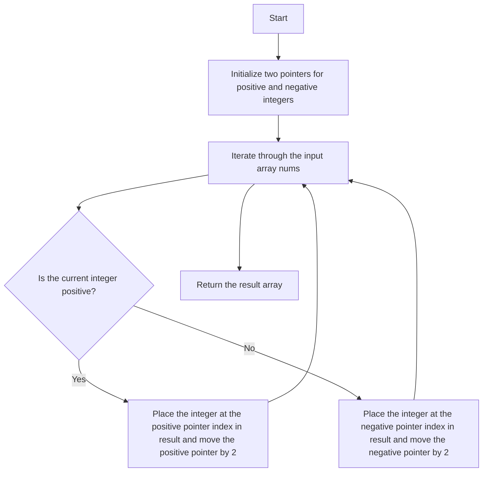

# 2149. Rearrange Array Elements by Sign

## Problem Statement

You are given a 0-indexed integer array `nums` of even length consisting of an equal number of positive and negative integers.

Rearrange the elements of `nums` such that the modified array follows the given conditions:

1. Every consecutive pair of integers have opposite signs.

2. For all integers with the same sign, the order in which they were present in `nums` is preserved.

3. The rearranged array begins with a positive integer.

Return the modified array after rearranging the elements to satisfy the aforementioned conditions.

### Example 1:
```
Input: nums = [3,1,-2,-5,2,-4]
Output: [3,-2,1,-5,2,-4]
Explanation:
The positive integers in nums are [3,1,2], and the negative integers are [-2,-5,-4]. The only possible way to rearrange them such that they satisfy all conditions is: [3,-2,1,-5,2,-4]. Note that there are no other ways to rearrange nums that satisfy all conditions. Thus, the answer is [3,-2,1,-5,2,-4].
```

### Example 2:
```
Input: nums = [-1,1]
Output: [1,-1]
Explanation:
The only way to rearrange nums such that it satisfies all conditions is: [1,-1]. Thus, the answer is [1,-1].
``` 

---

## Approach

To solve this problem, we can use `two pointers` technique. We will maintain two pointers, one for the positive integers and another for the negative integers.

Iterate through the input array `nums` and fill the positive integers at even indices and negative integers at odd indices in a new array `result`.



---

## Code Implementation

```cpp
class Solution {
public:
    vector<int> rearrangeArray(vector<int>& nums) {
        int n = nums.size();
        int positiveIndex = 0, negativeIndex = 1;
        vector<int> result(n);

        for(int i = 0; i < n; i++){
            if(nums[i] > 0){
                result[positiveIndex] = nums[i];
                positiveIndex+=2;
            }    
            else{
                result[negativeIndex] = nums[i];
                negativeIndex+=2;
            }
        }
        return result;
    }
};
```

---

## Complexity Analysis

- **Time Complexity**: O(n), where n is the length of the input array `nums`. We traverse the array once to rearrange the elements.

- **Space Complexity**: O(n), where n is the length of the input array `nums`. We use an additional array `result` to store the rearranged elements.

---