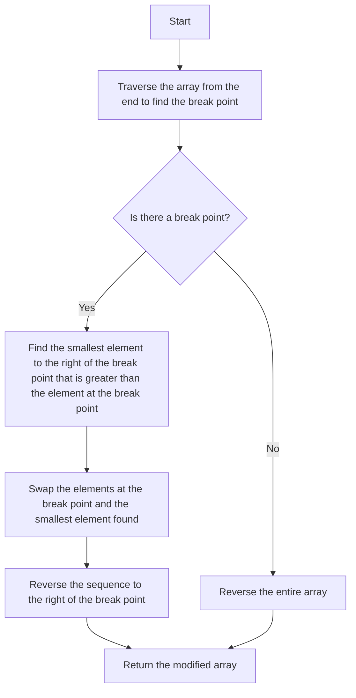

# 31. Next Permutation

## Problem Statement

Implement the `next permutation`, which rearranges numbers into the **lexicographically** next greater permutation of numbers.

If such an arrangement is not possible, it must rearrange it as the lowest possible order (i.e., sorted in ascending order).

The replacement must be **in place** and use only constant extra memory.

### Example 1:
```
Input: nums = [1,2,3]
Output: [1,3,2]
```

### Example 2:
```
Input: nums = [3,2,1]
Output: [1,2,3]
```

### Example 3:
```
Input: nums = [1,1,5]
Output: [1,5,1]
```

---

## Approach

When we think in normal terms, the next permutation of a number is the next greater number that can be formed by rearranging its digits. For example, the next permutation of `123` is `132`, and the next permutation of `321` is `123`.

We know we can find this by generating all permutations of the number and then finding the next one in the list. However, this approach is not efficient. But this will take `O(n!)` time complexity, which is not feasible for large numbers.

To reduce the `time complexity`, we can use the following approach:

1. Traverse the array from the end and find the first pair of indices `i` and `j` such that `nums[i] < nums[j]`. This means that the sequence from `i+1` to the end is in descending order. Now we have the `break point` at index `i`.

2. If we found such a pair, we need to find the smallest element in the sequence from `i+1` to the end that is greater than `nums[i]`. Let's say this element is at index `k`. We will swap `nums[i]` and `nums[k]`.

3. Finally, we need to reverse the sequence from `i+1` to the end to get the next permutation.

**What's the intuition behind this approach?**

- We are looking for the rightmost pair of indices where the left index is smaller than the right index. This is because we want to find the smallest change that can be made to get the next permutation.

- Once we find this pair, we want to find the smallest element to the right of the left index that is greater than the element at the left index. This is because we want to make the smallest change possible to get the next permutation.

- Finally, we reverse the sequence to the right of the left index because we want to get the smallest possible order for that part of the sequence.


---

## Code Implementation

```cpp
class Solution {
public:
    void nextPermutation(vector<int>& nums) {
        int n = nums.size();
        int breakPoint = -1;
        
        for(int i = n - 2; i >= 0; i--){
            if(nums[i] < nums[i + 1]){
                breakPoint = i;
                break;
            }
        }

        if(breakPoint != -1){
            for(int i = n - 1; i >= breakPoint; i--){
                if(nums[i] > nums[breakPoint]){
                    swap(nums[i], nums[breakPoint]);
                    break;
                }
            }
        }

        reverse(nums.begin() + breakPoint + 1, nums.end());
    }
};
```

---

## Complexity Analysis

- **Time Complexity**: O(n), where `n` is the length of the input array `nums`. This is because we are traversing the array a few times (at most 3 times) to find the break point, swap elements, and reverse the subarray.

- **Space Complexity**: O(1), since we are modifying the input array in place and not using any extra space.

---