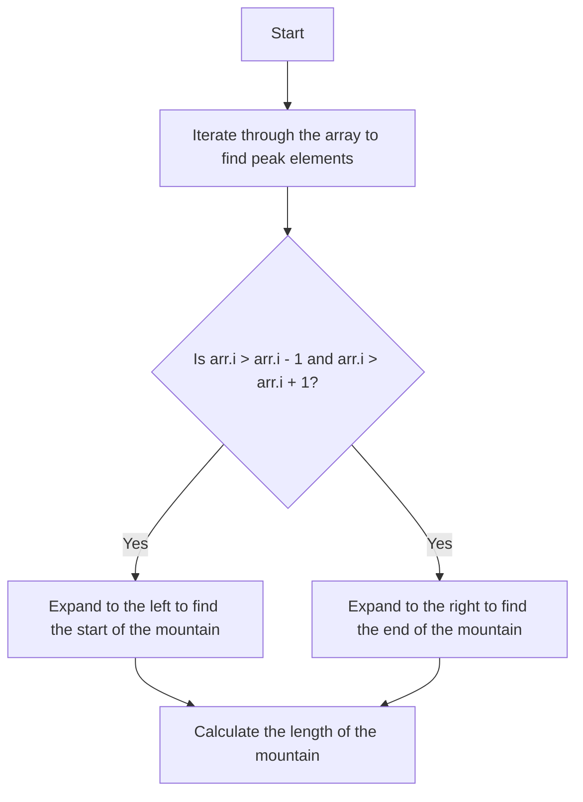

# 845. Longest Mountain in Array

## Problem Statement

You are given an array of integers `arr`. A mountain array is defined as an array that:

1. Has at least 3 elements.
2. There exists some index `i` (0 < i < arr.length - 1) such that:
   - `arr[0] < arr[1] < ... < arr[i - 1] < arr[i]` (strictly increasing)
   - `arr[i] > arr[i + 1] > ... > arr[arr.length - 1]` (strictly decreasing)    

Given an integer array `arr`, return the length of the longest mountain. If there is no mountain, return `0`.

### Example 1:
```
Input: arr = [2,1,4,7,3,2,5]
Output: 5
Explanation: The longest mountain is [1,4,7,3,2] which has length 5.
```

### Example 2:
```
Input: arr = [2,2,2]
Output: 0
Explanation: There is no mountain.
```

---

## Approach

To check whether a mountain exists, we need to find a `peak` element in the array. A peak element is defined as an element that is greater than its neighbors.

Once we find a peak element, we can expand to the left and right to find the length of the mountain. We will keep track of the longest mountain found so far.



---

## Code Implementation

```java
class Solution {
    public int longestMountain(int[] arr) {
        int n = arr.length, idx = 0;
        int longest = 0, curr = 0;

        for(int i = 1; i < n - 1; i++){
            if(arr[i] > arr[i - 1] && arr[i] > arr[i + 1]){
                int currLong = 0;
                int j = i - 1, k = i + 1;
                while(j - 1 >= 0 && arr[j] > arr[j - 1]){
                    j--;
                }
                while(k + 1 < n && arr[k] > arr[k + 1]){
                    k++;
                }
                currLong = (i - j) + (k - i) + 1;
                longest = Math.max(longest, currLong);
            }
        }
        return longest;

    }
}
```

---

## Complexity Analysis

- **Time Complexity**: O(n), where n is the length of the array. We traverse the array a constant number of times.

- **Space Complexity**: O(1), as we only use a constant amount of extra space.  

---