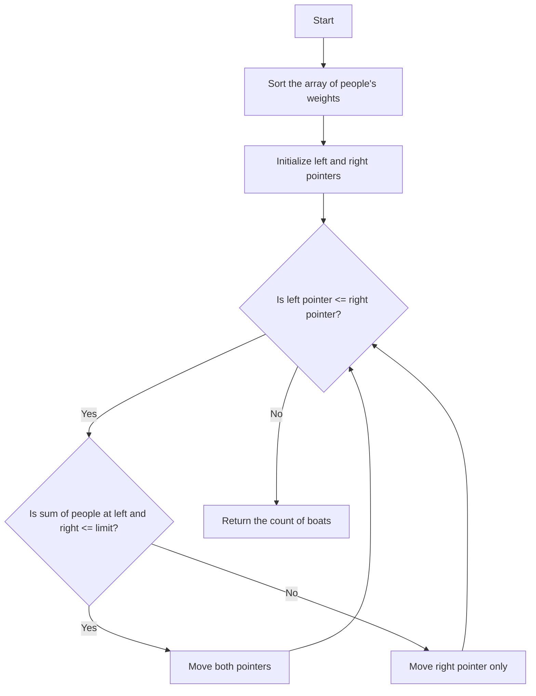

# 881. Boats to Save People

## Problem Statement

The i-th person has weight `people[i]`, and each boat can carry a maximum weight of `limit`. Each boat can carry at most 2 people at the same time, provided the sum of the weight of those people is at most `limit`.

Return the minimum number of boats to carry every given person. (It is guaranteed each person can be carried by a boat.)

### Example 1:
```
Input: people = [1,2], limit = 3
Output: 1
Explanation: 1 boat (1, 2)
```

### Example 2:
```
Input: people = [3,2,2,1], limit = 3
Output: 3
Explanation: 3 boats (1, 2), (2) and (3)
```

### Example 3:
```
Input: people = [3,5,3,4], limit = 5
Output: 4
Explanation: 4 boats (3), (3), (4), (5)
```

---

## Approach

We are tasked to find the `minimum number of boats` required to save all people given their weights and the boat's limit.

The intuition is that to minimize the number of boats, we should try to `pair` the `heaviest person` with the `lightest person` if possible. And to achieve this, we can `sort` the array of people's weights.

After sorting, we can use two pointers: one starting at the beginning of the array (pointing to the lightest person) and another starting at the end of the array (pointing to the heaviest person).

- If the `sum(people[left] + people[right])` is less than or equal to the `limit`, it means we can pair these two people together in one boat. So, we can move both pointers respectively.

- If the `sum(people[left] + people[right])` is greater than the `limit`, it means we cannot pair the heaviest person with the lightest person. In this case, we can only put the heaviest person in a boat alone, and move the right pointer one step left.

We continue this process until the left pointer is greater than the right pointer, which means we have considered all people.



---

## Code Implementation

```cpp
class Solution {
public:
    int numRescueBoats(vector<int>& people, int limit) {
        int n = people.size();
        sort(people.begin(), people.end());
        int left = 0, right = n - 1;
        int boats = 0;
        
        while(left <= right){
            if(people[left] + people[right] <= limit){
                boats++;
                left++; right--;
            }
            else if(people[right] <= limit){
                boats++; right--;
            }
        }
        return boats;
    }
};
```

--- 

## Complexity Analysis

- **Time Complexity**: O(n log n) due to the sorting step, where n is the number of people.

- **Space Complexity**: O(1) if we ignore the space used for sorting, otherwise O(n) due to the sorting algorithm's space complexity.

---